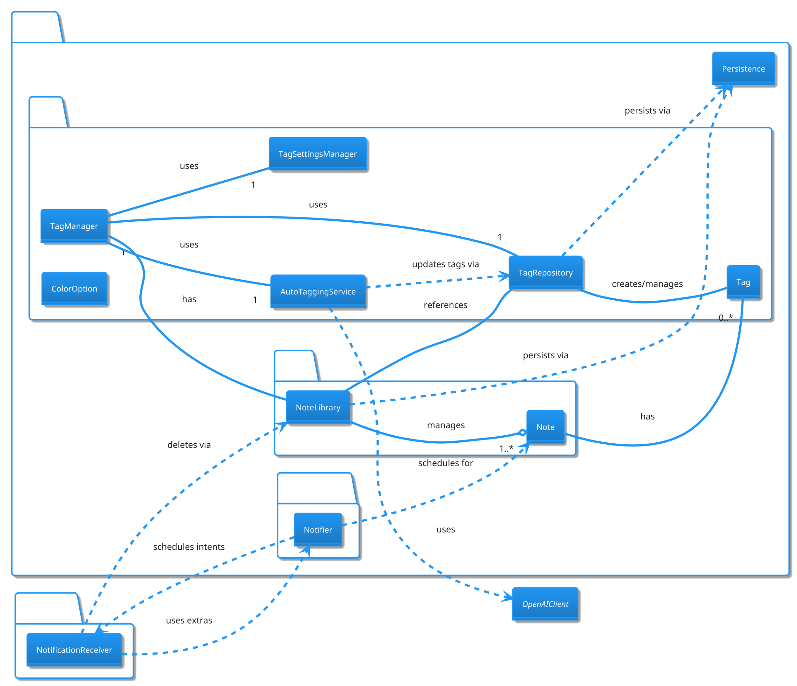

# Domain Model

```plantuml
@startuml
!theme materia
left to right direction
scale 3
skinparam defaultFontName SansSerif
hide attributes
hide methods
hide circle
hide empty methods

package "model.note" {
    class Note {
        + id: String
        + title: String
        + content: String
        + tags: Set<Tag>
        + lastModified: Date
        + isPinned: boolean
        + isNotificationsEnabled: boolean
        + notificationDate: Date?
        + setTag(tag: Tag): void
        + toString(): String
    }

    class NoteLibrary {
        - context: Context
        - notes: List<Note>
        - recentlyDeletedNote: Note
        + manageTags: TagManager

        + getNotes(): List<Note>
        + addNote(note: Note): void
        + deleteNote(note: Note): void
        + undoDelete(): boolean
        + searchNotes(query: String, title: boolean, content: boolean, tag: boolean): List<Note>
        + togglePin(note: Note): void
        + updateNoteNotificationSettings(note: Note, enabled: boolean, date: Date?): void
    }
}

package "model.tag" {
    class Tag {
        - name: String
        - colorResId: Int
    }

    class TagManager {
        + availableColors: List<ColorOption>
        + setTagColor(tagName: String, resId: Int): void
        + setTags(note: Note, names: List<String?>): void
        + cleanupUnusedTags(): void
        + renameTag(oldName: String, newName: String): void
        + deleteTag(tagName: String): void
        + mergeTags(sources: Collection<String?>, target: String): void
        + simpleAutoTag(note: Note, limit: int): void
        + aiAutoTag(note: Note, limit: int): void
        + aiSuggestTags(note: Note, limit: int, onSuggestions: Consumer<List<String?>>, onError: Consumer<String>): void
    }

    class TagRepository {
        + getTagColorRes(tagName: String): Int
        + setTagColor(tagName: String, resId: Int): void
        + setTags(note: Note, names: List<String?>): void
        + allTags(): Set<Tag>
        + allTagNames(): Set<String>
        + cleanupUnusedTags(): void
        + renameTag(oldName: String, newName: String): void
        + deleteTag(tagName: String): void
        + mergeTags(sourceNames: Collection<String?>, targetName: String): void
    }

    class TagSettingsManager {
        + isAiMode: boolean
        + autoTagLimit: int
        + selectedAiModelKey: String
        + isAiTaggingConfigured: boolean
        + isAiConfirmationEnabled: boolean
        + saveApiKey(key: String): void
    }

    class AutoTaggingService {
        + performSimpleAutoTag(note: Note, limit: int): void
        + performAiAutoTag(note: Note, limit: int, apiKey: String, existingTags: Set<String>, callback: TagAssignmentCallback): void
        + performAiSuggest(note: Note, limit: int, apiKey: String?, existingTags: Set<String>, callback: TagSuggestionsCallback): void
    }

    class ColorOption {
        + name: String
        + resId: Int
    }
}

package "model.notifications" {
    class Notifier {
        + isValidNotificationDate(date: Date?): boolean
        + cancelNotification(note: Note): void
        + scheduleNotification(note: Note): void
        + updateNotification(note: Note, enabled: boolean, date: Date?): void
    }
}

package "model" {
    class Persistence {
        + {static} loadNotes(ctx: Context): List<Note>
        + {static} saveNotes(ctx: Context, notes: List<Note>): void
        + {static} loadTagMap(ctx: Context): Map<String, Int>
        + {static} saveTagMap(ctx: Context, map: Map<String, Int>): void
    }
}

package "controller" {
    class NotificationReceiver
}

' External
interface OpenAIClient

' Relationships
NoteLibrary --o "1..*" Note : manages
Note -- "0..*" Tag : has
NoteLibrary -- "1" TagManager : has
TagManager -- "1" TagRepository : uses
TagManager -- "1" AutoTaggingService : uses
TagManager -- "1" TagSettingsManager : uses
TagRepository -- NoteLibrary : references
TagRepository -- Tag : creates/manages
NoteLibrary ..> Persistence : persists via
TagRepository ..> Persistence : persists via
AutoTaggingService ..> TagRepository : updates tags via
AutoTaggingService ..> OpenAIClient : uses
Notifier ..> Note : schedules for
Notifier ..> NotificationReceiver : schedules intents
NotificationReceiver ..> NoteLibrary : deletes via
NotificationReceiver ..> Notifier : uses extras

@enduml
```
