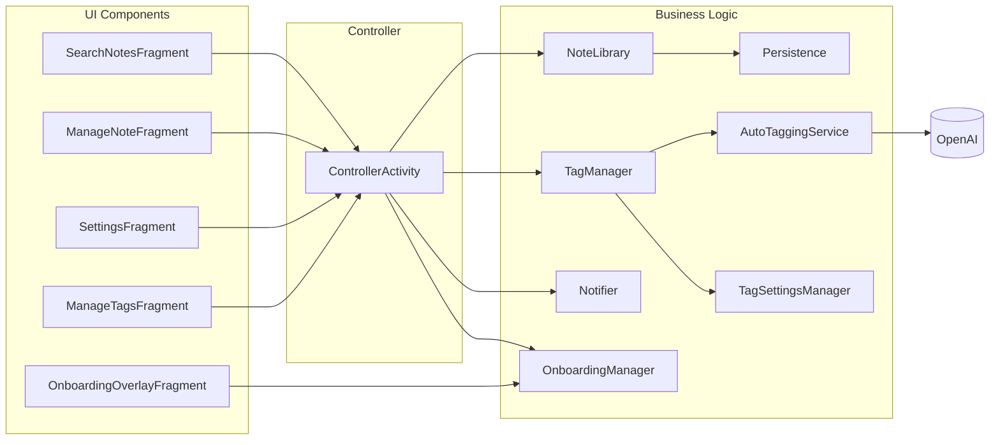

```mermaid
graph LR
    subgraph "UI Components"
        A[SearchNotesFragment]
        B[ManageNoteFragment]
        C[SettingsFragment]
        D[ManageTagsFragment]
        E[OnboardingOverlayFragment]
    end

    subgraph "Controller"
        X[ControllerActivity]
    end

    subgraph "Business Logic"
        F[NoteLibrary]
        G[TagManager]
        H[AutoTaggingService]
        I[TagSettingsManager]
        J[Notifier]
        K[OnboardingManager]
        L[Persistence]
    end

    A --> X
    B --> X
    C --> X
    D --> X
    E --> K

    X --> F
    X --> G
    X --> J
    X --> K

    F --> L
    G --> H
    G --> I
    H --> OpenAI[(OpenAI)]
```