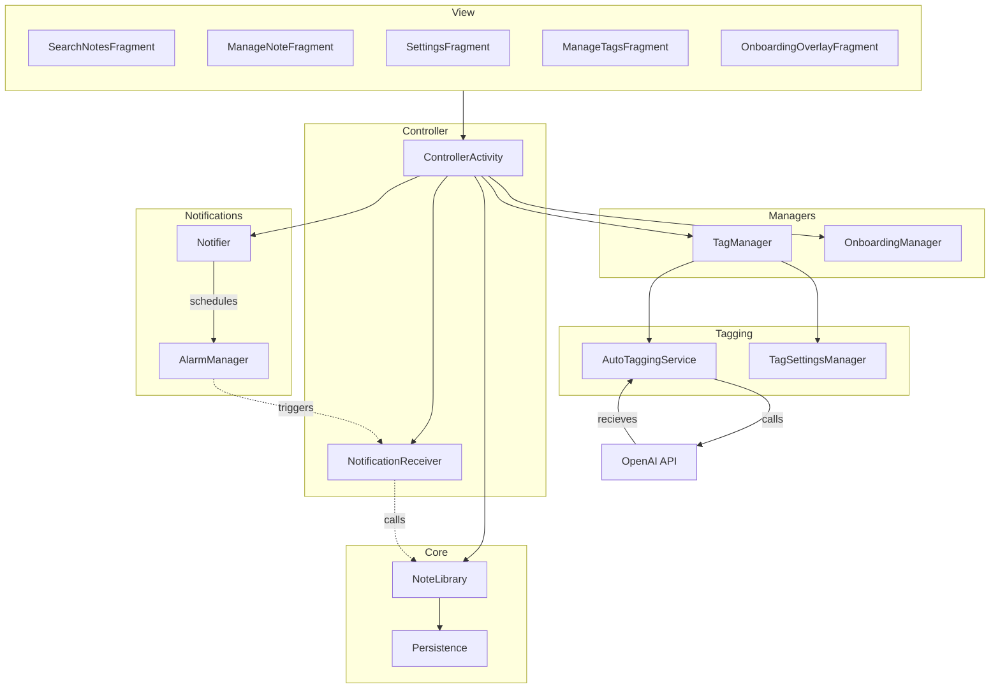

# Component Interaction Diagram

This diagram shows how components interact across the application layers.

```mermaid
flowchart TB
    %% Top: View Layer
    subgraph "View"
        direction TB
        SF[SearchNotesFragment]
        MF[ManageNoteFragment]
        SETF[SettingsFragment]
        TF[ManageTagsFragment]
        OF[OnboardingOverlayFragment]
    end

    %% Middle: Controller Layer
    subgraph Controller["Controller"]
        direction LR
        CA[ControllerActivity]
        NR[NotificationReceiver]
    end

    %% Managers - directly below Controller
    subgraph "Managers"
        direction LR
        TM[TagManager]
        OM[OnboardingManager]
    end

    %% Notifications - directly below Controller
    subgraph "Notifications"
        direction TB
        NOT[Notifier]
        AM[AlarmManager]
    end

    %% Tagging Domain
    subgraph "Tagging"
        ATS[AutoTaggingService]
        TSM[TagSettingsManager]
    end

    %% Core Domain
    subgraph "Core"
        NL[NoteLibrary]
        PERS[Persistence]
    end

    %% External Services
    OAI[OpenAI API]

    %% View to Controller
    View --> CA

    %% Controller internal
    CA --> NR

    %% Controller to Managers and Notifications
    CA --> TM
    CA --> OM
    CA --> NOT
    CA --> NL

    %% Domain internal relationships
    TM --> ATS
    TM --> TSM
    NL --> PERS

    %% External connections
    ATS -->|calls| OAI
    OAI -->|recieves| ATS
    NOT -->|schedules| AM
    AM -.->|triggers| NR
    NR -.->|calls| NL
```
