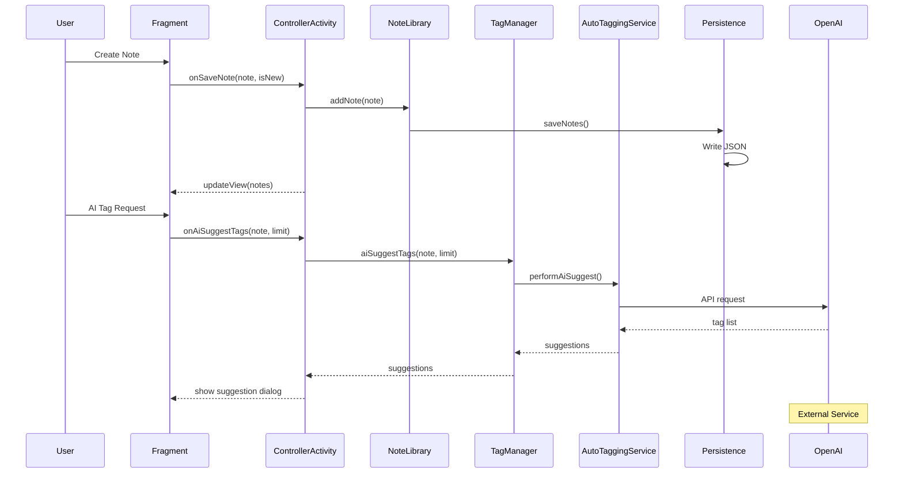

```mermaid
sequenceDiagram
    participant User
    participant Fragment
    participant Controller as ControllerActivity
    participant NoteLibrary
    participant TagManager
    participant AutoTaggingService
    participant Persistence
    participant OpenAI

    User->>Fragment: Create Note
    Fragment->>Controller: onSaveNote(note, isNew)
    Controller->>NoteLibrary: addNote(note)
    NoteLibrary->>Persistence: saveNotes()
    Persistence->>Persistence: Write JSON
    Controller-->>Fragment: updateView(notes)

    User->>Fragment: AI Tag Request
    Fragment->>Controller: onAiSuggestTags(note, limit)
    Controller->>TagManager: aiSuggestTags(note, limit)
    TagManager->>AutoTaggingService: performAiSuggest()
    AutoTaggingService->>OpenAI: API request
    OpenAI-->>AutoTaggingService: tag list
    AutoTaggingService-->>TagManager: suggestions
    TagManager-->>Controller: suggestions
    Controller-->>Fragment: show suggestion dialog

    Note over OpenAI: External Service
```
