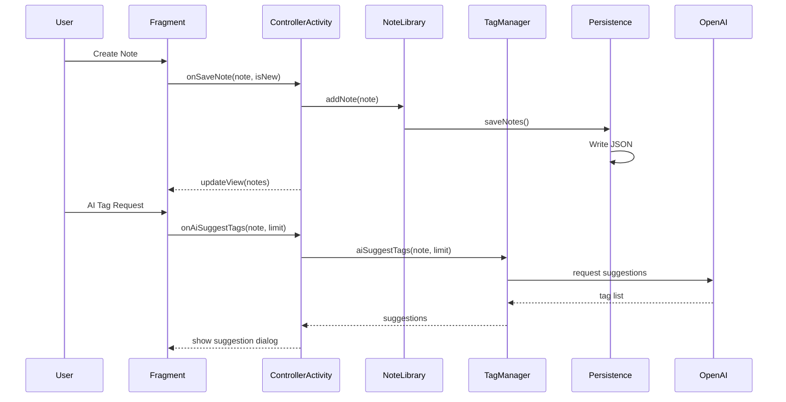

```mermaid
sequenceDiagram
    participant User
    participant Fragment
    participant Controller as ControllerActivity
    participant NoteLibrary
    participant TagManager
    participant Persistence
    participant OpenAI

    User->>Fragment: Create Note
    Fragment->>Controller: onSaveNote(note, isNew)
    Controller->>NoteLibrary: addNote(note)
    NoteLibrary->>Persistence: saveNotes()
    Persistence->>Persistence: Write JSON
    Controller-->>Fragment: updateView(notes)

    User->>Fragment: AI Tag Request
    Fragment->>Controller: onAiSuggestTags(note, limit)
    Controller->>TagManager: aiSuggestTags(note, limit)
    TagManager->>OpenAI: request suggestions
    OpenAI-->>TagManager: tag list
    TagManager-->>Controller: suggestions
    Controller-->>Fragment: show suggestion dialog
```
