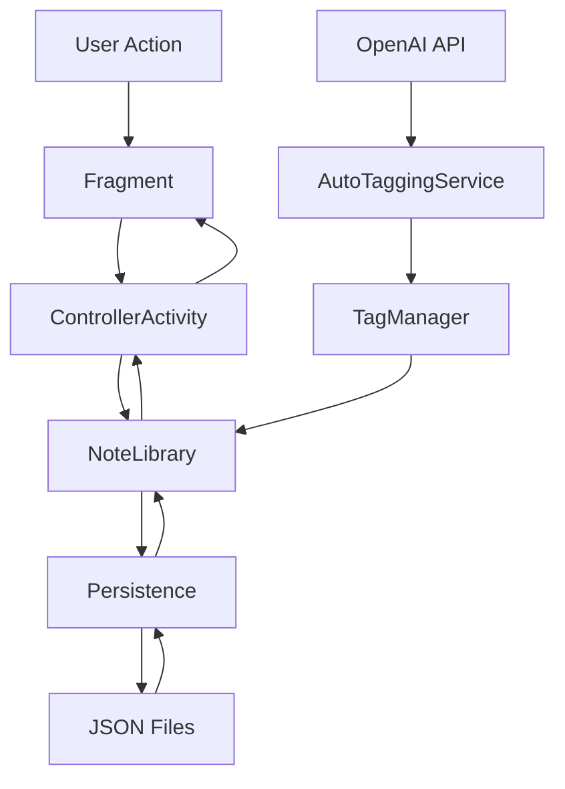

```mermaid
graph TD
    A[User Action] --> B[Fragment]
    B --> X[ControllerActivity]
    X --> D[NoteLibrary]
    D --> E[Persistence]
    E --> F[JSON Files]

    F --> E
    E --> D
    D --> X
    X --> B

    G[OpenAI API] --> H[AutoTaggingService]
    H --> I[TagManager]
    I --> D
```
