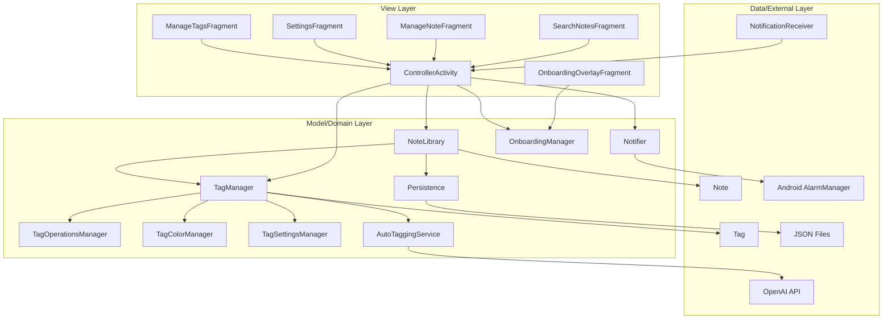

```mermaid
graph TB
    subgraph "View Layer"
        A[ControllerActivity]
        B[SearchNotesFragment]
        C[ManageNoteFragment]
        D[SettingsFragment]
        E[ManageTagsFragment]
        F[OnboardingOverlayFragment]
    end

    subgraph "Model/Domain Layer"
        H[NoteLibrary]
        I[TagManager]
        I1[TagOperationsManager]
        I2[TagColorManager]
        I3[TagSettingsManager]
        J[AutoTaggingService]
        K[Notifier]
        L[Persistence]
        O[OnboardingManager]
    end

    subgraph "Data/External Layer"
        M[Note]
        N[Tag]
        P[JSON Files]
        Q[OpenAI API]
        R[Android AlarmManager]
        S[NotificationReceiver]
    end

    %% Controller mediates between View and Model
    B --> A
    C --> A
    D --> A
    E --> A
    F --> O
    A --> H
    A --> I
    A --> K
    A --> O

    %% Model interactions
    H --> L
    H --> I
    I --> I1
    I --> I2
    I --> I3
    I --> J
    J --> Q
    K --> R
    S --> A

    %% Data layer
    L --> P
    H --> M
    I --> N
```