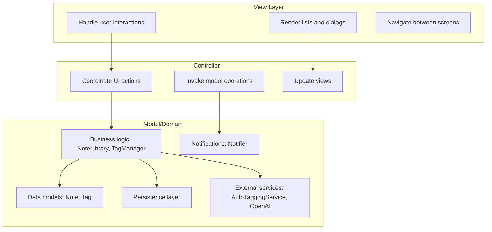

```mermaid
graph TB
    subgraph "View Layer"
        A1[Handle user interactions]
        A2[Render lists and dialogs]
        A3[Navigate between screens]
    end

    subgraph "Controller"
        B1[Coordinate UI actions]
        B2[Invoke model operations]
        B3[Update views]
    end

    subgraph "Model/Domain"
        C1[Data models: Note, Tag]
        C2[Business logic: NoteLibrary, TagManager]
        C3[Persistence layer]
        C4[External services: AutoTaggingService, OpenAI]
        C5[Notifications: Notifier]
    end

    A1 --> B1
    A2 --> B3
    B1 --> C2
    C2 --> C3
    C2 --> C4
    C2 --> C1
    B2 --> C5
```
