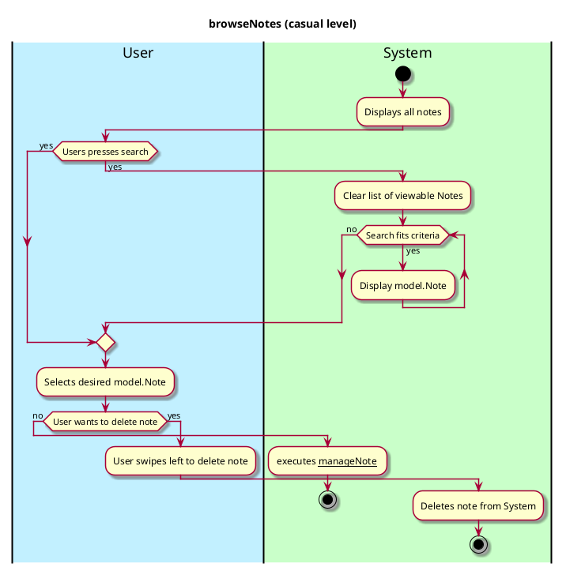
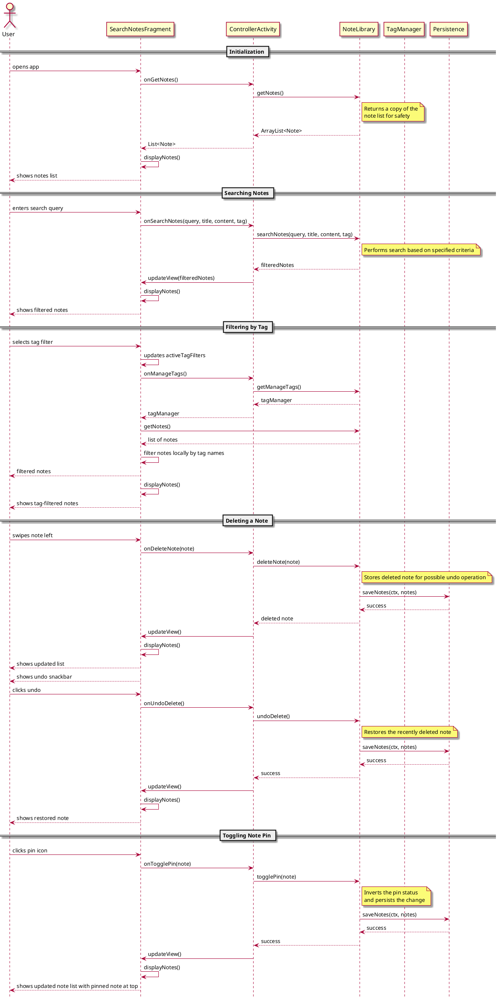

# NoteLibrary

## 1. Primary actor and goals
Who is the main interested party and what goal(s) this use case is designed to help them achieve.

__User__: Able to navigate the through the app with ease and search through their previous notes to find the one they want.

## 2. Other stakeholders and their goals

No other stakeholders 

## 2. Preconditions

What must be true prior to the start of the use case.

User provides search criteria before pressing search.

## 4. Postconditions

What must be true upon successful completion of the use case.

* User is returned to this menu
* If the user has added a note, this is reflected at the top of the notes section
* User was able to successfully browse and search for a desired note.

## 4. Workflow

The sequence of steps involved in the execution of the use case, in the form of one or more activity diagrams (please feel free to decompose into multiple diagrams for readability).

The workflow can be specified at different levels of detail:

* __Brief__: main success scenario only;
* __Casual__: most common scenarios and variations;
* __Fully-dressed__: all scenarios and variations.

Please be sure indicate what level of detail the workflow you include represents.

## Sequence Diagram

