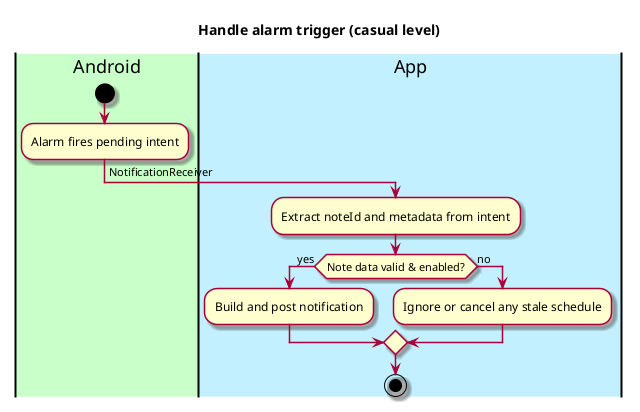
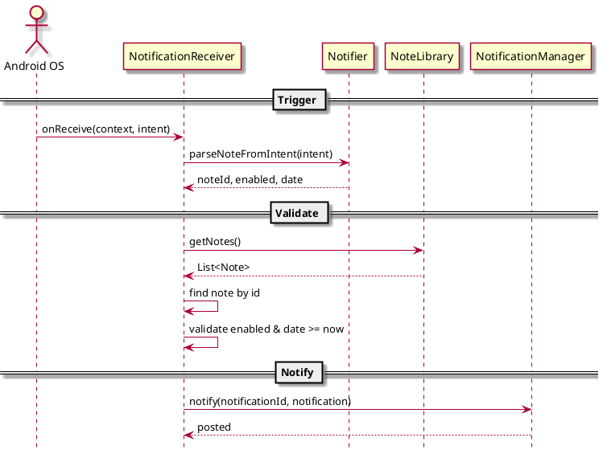

# NotificationReceiver

## 1. Primary actor and goals

__System (Android Alarm/Work)__: Delivers a scheduled trigger. The app should surface a user-facing notification for the related `Note`, and handle user actions from that notification (e.g., open note, dismiss, delete).

## 2. Other stakeholders and their goals

- __Note Taker__: Receives the reminder at the correct time and can act quickly.

## 3. Preconditions

- A `Note` has notifications enabled and a valid future `notificationDate`.
- Global notifications are enabled and, where required, exact alarm permissions are granted.
- A pending intent has been scheduled by `Notifier`.

## 4. Postconditions

- A system notification is posted for the `Note` at the scheduled time, or the trigger is ignored if stale or disabled.
- Optional cleanup actions are performed (e.g., reschedule or cancel).

## 5. Activity (casual level)

## 6. Sequence Diagram

