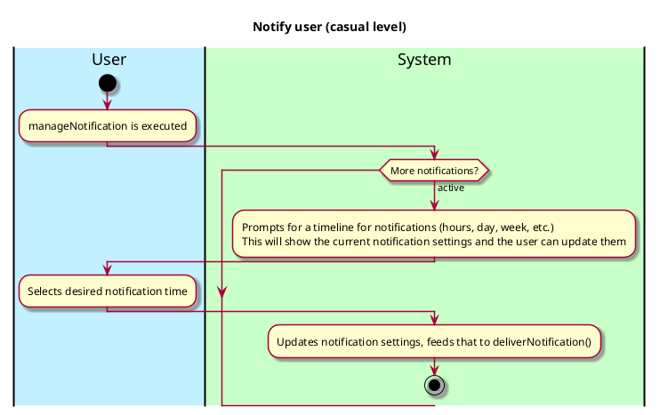
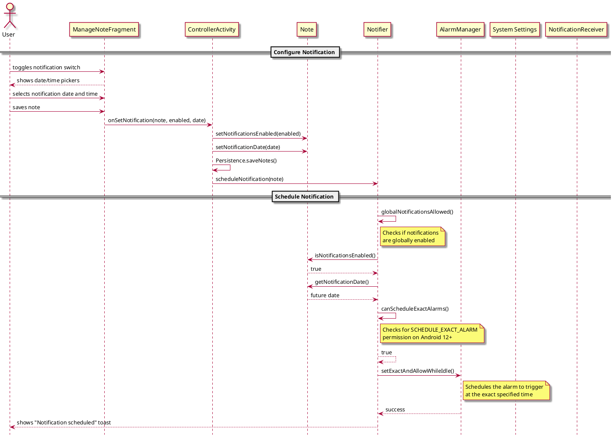

# Notifier

## 1. Primary actor and goals
Who is the main interested party and what goal(s) this use case is designed to help them achieve. For example, for _process sale_:

__Note Taker__: Wants to have their previously inputted notes notified back to them, they want to change the notification settings to exactly what they prefer.

## 2. Other stakeholders and their goals

No other stakeholders

## 2. Preconditions

What must be true prior to the start of the use case.

* User has notifications enabled globally and a note has metadata to notify the user.

## 4. Postconditions

What must be true upon successful completion of the use case.

* Notification data is updated
* Alarm is scheduled with the system (if applicable)
* User receives visual confirmation of scheduled notification

## 4. Workflow

The sequence of steps involved in the execution of the use case, in the form of one or more activity diagrams (please feel free to decompose into multiple diagrams for readability).

The workflow can be specified at different levels of detail:

* __Brief__: main success scenario only;
* __Casual__: most common scenarios and variations;
* __Fully-dressed__: all scenarios and variations.

Please be sure indicate what level of detail the workflow you include represents.

## Sequence Diagram

