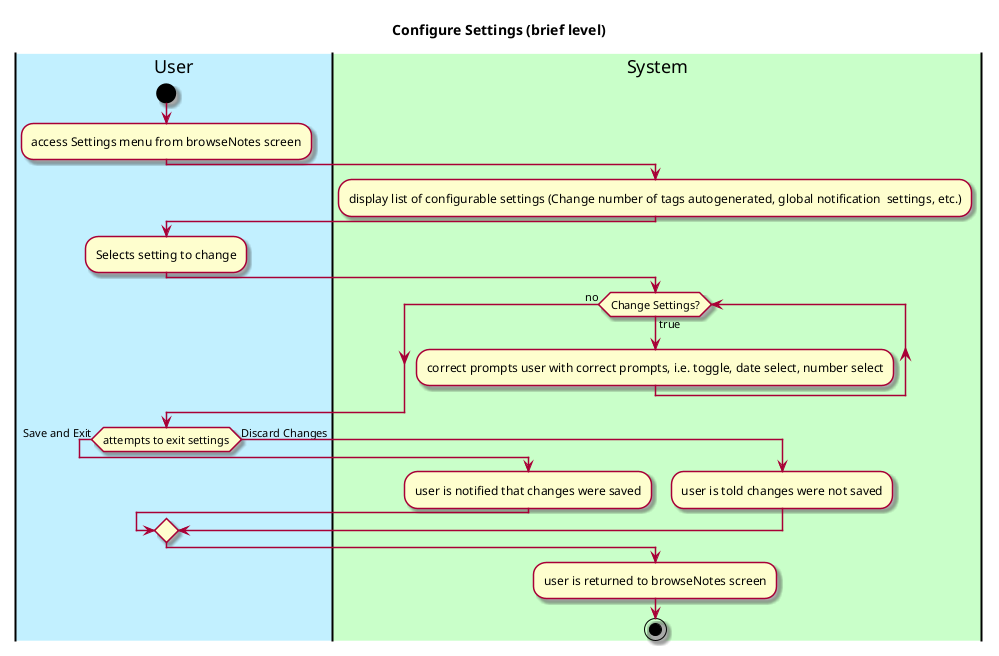
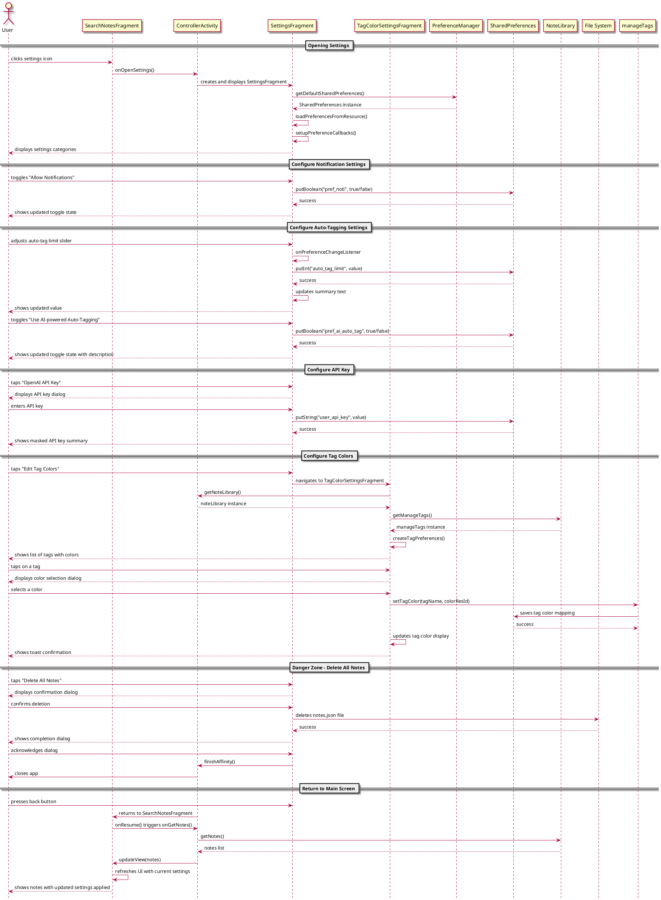

# Configure Settings

## 1. Primary actor and goals
Who is the main interested party and what goal(s) this use case is designed to help them achieve.

__User__: wants to be able to change settings to customize their experience to their liking, like changing the theme or enabling automatic notifications.

## 2. Other stakeholders and their goals

No other stakeholders.

## 2. Preconditions

What must be true prior to the start of the use case.

Settings menu icon is opened

## 4. Postconditions

What must be true upon successful completion of the use case.

* Users changes are saved
* User is notified that changed have been saved
* Settings modifications are implemented at app refresh or immediately, if possible.

## 4. Workflow

The sequence of steps involved in the execution of the use case, in the form of one or more activity diagrams (please feel free to decompose into multiple diagrams for readability).

The workflow can be specified at different levels of detail:

* __Brief__: main success scenario only;
* __Casual__: most common scenarios and variations;
* __Fully-dressed__: all scenarios and variations.

Please be sure indicate what level of detail the workflow you include represents.

## Sequence Diagram

