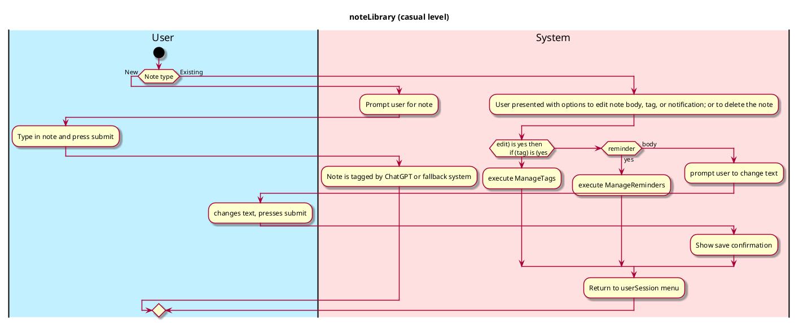
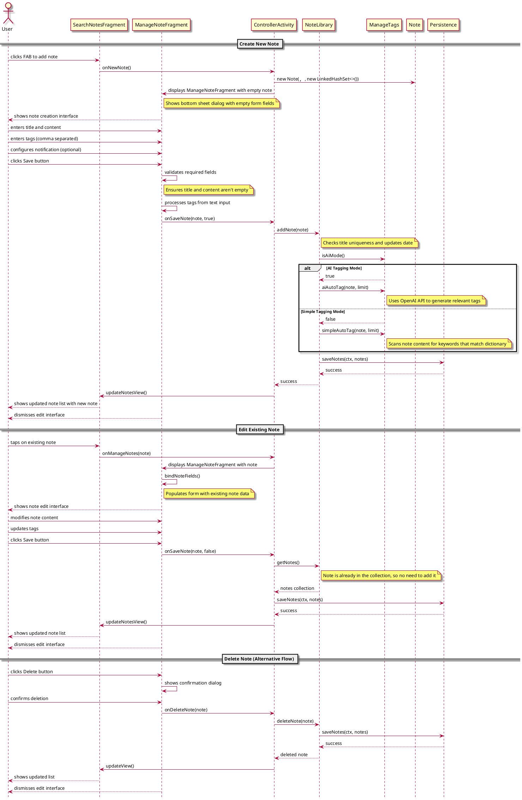

# ManageNote

## 1. Primary actor and goals
Who is the main interested party and what goal(s) this use case is designed to help them achieve.

__User__: Wants to add a Note to the app quickly and in as little steps as possible, or to manage a previously made note.

## 2. Other stakeholders and their goals

No other stakeholders.

## 2. Preconditions

What must be true prior to the start of the use case.

* User has picked a note to manage or selected new note

## 4. Postconditions

What must be true upon successful completion of the use case.

Note is saved and tagged.
If requested by User, Note is deleted.
User is indicated that changes are saved.

## 4. Workflow

The sequence of steps involved in the execution of the use case, in the form of one or more activity diagrams (please feel free to decompose into multiple diagrams for readability).

The workflow can be specified at different levels of detail:

* __Brief__: main success scenario only;
* __Casual__: most common scenarios and variations;
* __Fully-dressed__: all scenarios and variations.

## Sequence Diagram

