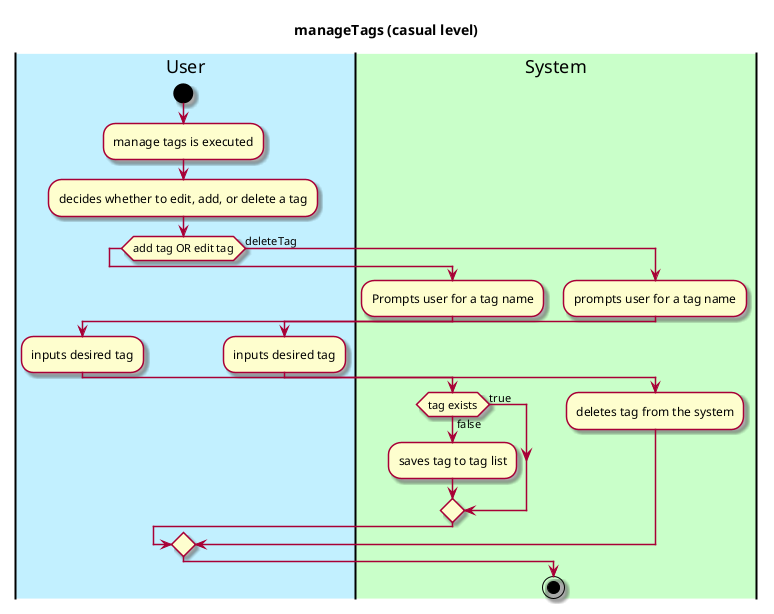
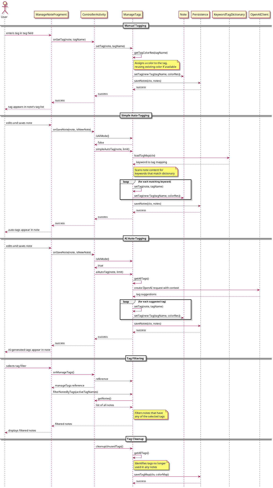

# Manage Tags

## 1. Primary actor and goals
Who is the main interested party and what goal(s) this use case is designed to help them achieve.

__User__: Wants to input a tag into the system for their thoughts

## 2. Other stakeholders and their goals

* __System__: wants to easily manage the tags in the system

## 2. Preconditions

What must be true prior to the start of the use case.

* Manage tags menu is opened
* Note to be tagged is identified/tag to be edited is identified

## 4. Postconditions

What must be true upon successful completion of the use case.

* Tag is saved
* note is tagged if that is what user wants
* Tag is updated to the tag list if that is what user wants
* tag edited/deleted if that is what user wants

## 4. Workflow

The sequence of steps involved in the execution of the use case, in the form of one or more activity diagrams (please feel free to decompose into multiple diagrams for readability).

The workflow can be specified at different levels of detail:

* __Brief__: main success scenario only;
* __Casual__: most common scenarios and variations;
* __Fully-dressed__: all scenarios and variations.

Please be sure indicate what level of detail the workflow you include represents.

## Sequence Diagram

