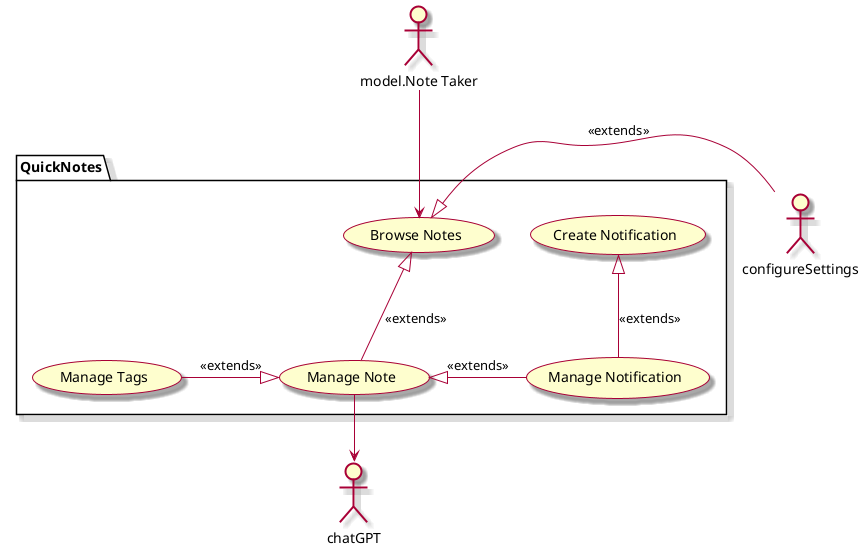

# QuickNotes by Pmill and Jbergman

## 1. Introduction

We envision a nifty notes application that is able to take a simple text input of a task, reminder, or general note by a user, then smartly categorize that "thought" into several different categories.

## 2. Business case

Things that our notes app can do that Apple's or other standard note apps do not:

- Organize lists using a tag system for easy management, either by the user or automatically by QuickNotes

Intended for people who want something as intuitive as a simple notes app, but with slightly more powerful features like tags.

## 3. Key functionality
- Notes taking
- Note management via tags automatically 
- Manual user tag editing
- Notifications to remind users of desired Notes
- Integration with ChatGPT for smart tagging system
- Fallback tag implementation in case ChatGPT in inoperable

## 4. Stakeholder goals summary
- **Note Taker**: adds Notes, edit Notes, manually assign tags, manage model, set reminder frequency.

## Use case diagram

